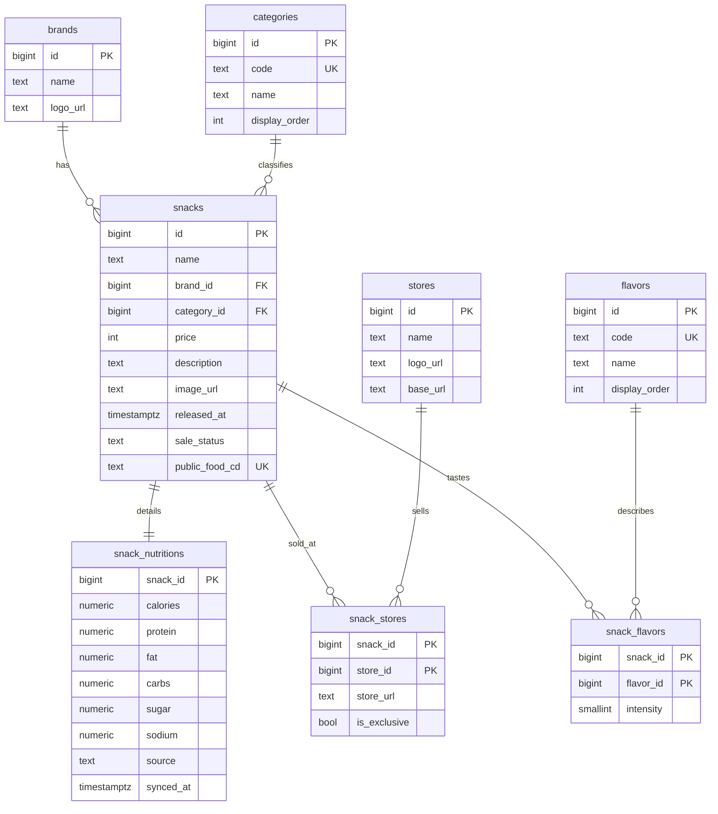

# Snack Dict — DB 스키마 문서 (-ing)

> MVP 단계의 데이터베이스 설계 문서입니다.
> 변경사항은 `supabase/migrations/`의 마이그레이션 파일과 함께 업데이트해주세요.

## 개요

- **DB**: Supabase (PostgreSQL)
- **테이블 수**: 8개 (마스터 4개 + 핵심 1개 + 의존 3개)
- **데이터 출처**: 공공데이터포털 가공식품 영양정보 API + 수동 큐레이션

## ER 다이어그램



> GitHub에서 이 파일을 보면 위 다이어그램이 자동으로 그림으로 렌더링됩니다.

## 테이블별 설명

### 마스터 테이블 (참조용)

#### `brands` — 브랜드 마스터

- 롯데웰푸드, 오리온, 해태제과 등의 제조사
- 데이터 소스: 공공 API의 `mfrNm` 필드에서 자동 추출 + 큐레이션
- `name`은 unique — 같은 브랜드 중복 등록 방지

#### `stores` — 판매처 마스터

- GS25, CU, 세븐일레븐, 쿠팡, 마트 등
- 데이터 소스: 수동 입력
- `name`은 unique

#### `categories` — 카테고리 마스터

- MVP 1차 분류 8개:
  - `SNACK` (스낵)
  - `BISCUIT` (비스킷)
  - `PIE` (파이/케이크)
  - `CHOCOLATE` (초콜릿)
  - `JELLY` (젤리)
  - `CANDY_GUM` (캔디&껌)
  - `BREAD` (빵)
  - `RICE_CAKE` (떡)
- `code`로 코드에서 참조, `name`은 표시용 (자유롭게 변경 가능)
- `display_order`로 UI 정렬 순서 제어
- 시드 데이터 마이그레이션에 포함

#### `flavors` — 맛 마스터

- MVP 1차 맛 6개:
  - `SWEET` (단맛)
  - `SALTY` (짠맛)
  - `SPICY` (매콤)
  - `BITTER` (쌉쌀함)
  - `SOUR` (신맛)
  - `OILY` (느끼)
- 시드 데이터 마이그레이션에 포함

### 핵심 테이블

#### `snacks` — 상품 마스터

- 너희 서비스의 핵심 테이블. 큐레이션 정보가 다 여기 들어감
- `brand_id`, `category_id`로 마스터 참조
- `public_food_cd`는 공공 API의 `foodCd` — ETL 시 upsert 키 (unique)
- `sale_status`는 enum-like 값:
  - `on_sale` (판매 중, 기본값)
  - `sold_out` (품절)
  - `discontinued` (단종)
- `released_at`으로 신상 여부 판단 (`is_new` 같은 boolean 안 씀)
- `price`는 integer (한국 원화는 소수점 없음)

### 의존 테이블

#### `snack_nutritions` — 영양정보 (1:1)

- `snack_id`가 PK이자 FK → 자동으로 1:1 관계 강제
- `snacks` 삭제 시 `cascade`로 같이 삭제
- `source`로 데이터 출처 추적 (`public_api` / `manual`)
- `synced_at`으로 마지막 동기화 시점 기록
- 모든 영양 수치는 `numeric(8, 2)` — float 부동소수점 오차 방지

#### `snack_stores` — 과자 × 판매처 (다대다)

- 복합 PK `(snack_id, store_id)` — 같은 조합 중복 방지
- `is_exclusive`: 전용상품 여부 (예: GS25 전용)
- `store_url`: 해당 판매처에서의 개별 상품 URL

#### `snack_flavors` — 과자 × 맛 (다대다)

- 복합 PK `(snack_id, flavor_id)`
- `intensity` (1~5): 맛의 강도
  - 1: 약함
  - 5: 매우 강함
  - 기본값 3
- check 제약으로 1~5 범위 강제

## 관계 정리

### 일대일 (1:1)

- `snacks ↔ snack_nutritions`
- 한 과자엔 하나의 영양정보만

### 일대다 (1:N)

- `brands → snacks`: 한 브랜드는 여러 과자 가짐
- `categories → snacks`: 한 카테고리에 여러 과자

### 다대다 (N:M)

- `snacks ↔ stores` (중간 테이블: `snack_stores`)
  - 한 과자는 여러 판매처에서 팔리고, 한 판매처는 여러 과자를 판매
- `snacks ↔ flavors` (중간 테이블: `snack_flavors`)
  - 한 과자는 여러 맛을 가지고 (단맛 + 짠맛), 한 맛은 여러 과자에 적용

## 데이터 출처 정책

```
[공공데이터 API]
   ↓ ETL (자동)
   - foodNm     → snacks.name
   - mfrNm      → brands.name (자동 등록)
   - foodCd     → snacks.public_food_cd
   - 영양성분    → snack_nutritions.*

[수동 큐레이션]
   - 가격, 출시일, 이미지, 설명 → snacks.*
   - 카테고리 매핑              → snacks.category_id
   - 맛 매핑                    → snack_flavors
   - 판매처 매핑                → snack_stores
```

## 향후 확장 (참고)

MVP에는 포함되지 않지만 미래에 추가 예정:

- `profiles` — 사용자 프로필 (Supabase Auth 연동)
- `reviews` — 리뷰
- `review_comments` — 댓글 (대댓글 지원: `parent_comment_id`)
- `curators` + `curator_picks` — 과믈리에 시스템
- `tags` — 추가 태그 시스템 (필요 시)

## 변경 이력

- 2026-05-12: 초기 스키마 설계 (Phase 1)

MVP에는 포함되지 않지만 미래에 추가 예정:

- `profiles` — 사용자 프로필 (Supabase Auth 연동)
- `reviews` — 리뷰
- `review_comments` — 댓글 (대댓글 지원: `parent_comment_id`)
- `curators` + `curator_picks` — 과믈리에 시스템
- `tags` — 추가 태그 시스템 (필요 시)

## 변경 이력

- 2026-05-12: 초기 스키마 설계 (Phase 1)
